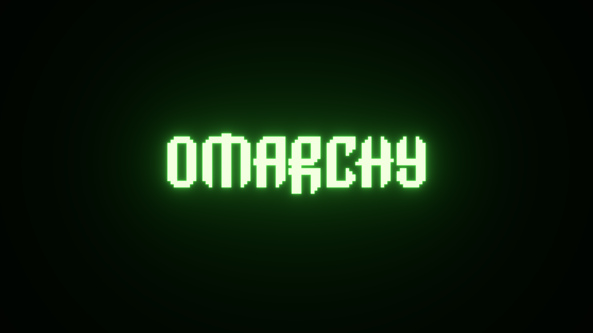
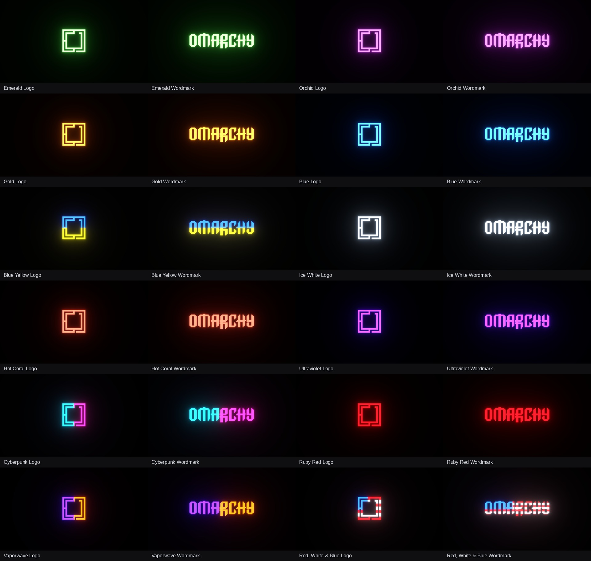

# Neon Glow

One Omarchy theme. Twelve color palettes. Change the wallpaper and the desktop colors follow.



24 wallpapers in 4K: a logo and wordmark for each color. Black backgrounds, glowing accents, and matching terminal colors throughout.

**Requires Omarchy 4 / Quattro with Omarchy Shell.** Tested on `4.0.0.alpha`; older Waybar-based Omarchy versions are unsupported.

## Install

Automatic color switching requires a small background service that watches wallpaper changes and applies the matching palette while Neon Glow is selected. The command below installs both the theme and this service:

```sh
omarchy theme install https://github.com/ejuro/omarchy-neon-glow-theme && bash ~/.config/omarchy/themes/neon-glow/install.sh
```

**Already installed the theme?** Run this once to install the background service and enable automatic color switching:

```sh
bash ~/.config/omarchy/themes/neon-glow/install.sh
```

That's it. Neon Glow activates and the small palette service starts automatically at login. Use the normal background picker or your wallpaper shortcut. The logo and wordmark share the same palette within each color.

The service remains running when you switch themes, but only applies changes while Neon Glow is selected. It sleeps between file-change notifications instead of polling. Switching back resumes automatic color matching. To remove the service, follow the [uninstall instructions](#uninstall) below.

The standard theme installer alone provides the wallpapers and a static Emerald palette. The setup command enables the automatic color switching. No root access, extra Python packages, or edits to Neovim, cliamp, terminal, or other application config files are needed by setup.

## Colors



Emerald · Orchid · Gold · Blue · Blue & Yellow · Ice White · Hot Coral · Ultraviolet · Cyberpunk · Ruby Red · Vaporwave · Red, White & Blue

The bar, terminal, and main menu backgrounds stay black. Text, borders, selections, syntax highlighting, and terminal color slots follow the selected palette. Multicolor wallpapers use their matching color combinations.

Terminal slots named `green`, `yellow`, and `blue` are deliberately themed too. In Ruby Red, they are shades of red; in Blue, shades of blue. Apps using terminal colors, including cliamp's default visualizer, inherit them automatically. Apps with their own fixed colors may behave differently.

## Update

After updating or reinstalling the repository, run setup again:

```sh
git -C ~/.config/omarchy/themes/neon-glow pull --ff-only
bash ~/.config/omarchy/themes/neon-glow/install.sh
```

Also rerun setup after an Omarchy upgrade that changes theme templates. It regenerates compatible app configs and preserves the currently selected wallpaper when Neon Glow is already active.

## Uninstall

To remove automatic color switching:

```sh
bash ~/.config/omarchy/themes/neon-glow/uninstall.sh
```

This removes the user service and generated palette cache. The current appearance and the theme folder remain. To remove the theme completely, switch to another theme first, then remove `~/.config/omarchy/themes/neon-glow`.

## How it works

Setup generates all 12 palettes using your installed Omarchy templates and any user template overrides. Generated files live in `~/.local/state/neon-glow/palettes/`, outside the repository. Executable app configurations such as Neovim Lua and terminal configs are regenerated locally instead of relying on bundled versions.

A small user service uses Linux file-change notifications (inotify) to watch the selected theme and wallpaper, applies the matching palette, and uses Omarchy's own refresh commands. It remains running but does not apply changes to other themes, and has no periodic polling while idle. Failed palette updates are retried after a short delay. Custom wallpapers without a palette mapping retain the current colors.

```sh
systemctl --user status neon-glow.service
journalctl --user -u neon-glow.service
```

Wallpapers and original theme by Erik Johansson. Based on Emerald Glow and Omarchy. [MIT license](LICENSE) · [Third-party notices](THIRD_PARTY_NOTICES.md)
